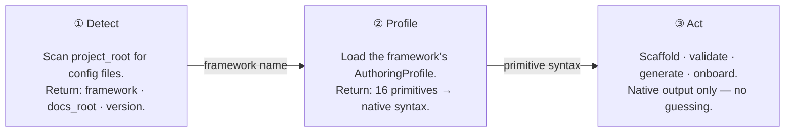
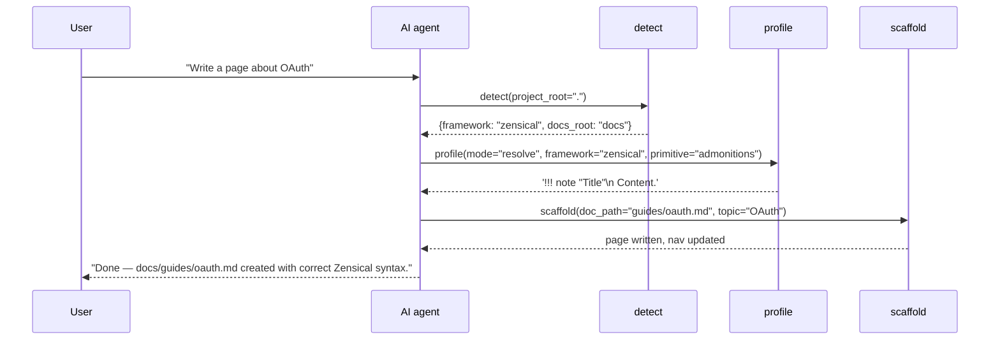

# Detect → Profile → Act

Every tool in mcp-zen-of-docs follows the same three-step pattern. Understanding it
explains why the tools work without configuration — and why the output is correct on the
first try.

---

## The problem

- `!!! note`, `:::note`, `::: info`, `<Aside>` — all four mean "note admonition". Three of four will render as raw text in any given project.
- AI models train on all frameworks at once. Without context, output is a statistical blend.
- The fix isn't prompt engineering — it's reading the facts from the project before acting.

---

## The pattern



Three steps. Each feeds the next. The AI never guesses.

---

## Step 1 — Detect

**What it does:** Scans `project_root` for framework config files and identifies which
framework is present.

**Config files scanned:**

| Framework | File |
|-----------|------|
| Zensical | `zensical.toml` or `mkdocs.yml` |
| Docusaurus | `docusaurus.config.js` / `.ts` |
| VitePress | `.vitepress/config.*` |
| Starlight | `astro.config.mjs` / `.ts` |

**What it returns:** A `FrameworkDetectionResult` with `framework`, `version`, `docs_root`,
`config_file`, and `support_matrix`.

```python
detect(mode="full", project_root=".")
# → {
#     "framework": "zensical",
#     "version": "1.x",
#     "docs_root": "docs",
#     "config_file": "zensical.toml",
#     "support_matrix": {"admonitions": "native", "diagrams": "native", ...}
#   }
```

**What the next step uses:** The `framework` name to load the correct profile.

---

## Step 2 — Profile

**What it does:** Loads the `AuthoringProfile` for the detected framework. This object
maps all 16 universal authoring primitives to the framework's native syntax.

**What it returns:** A profile with a `render_primitive(name, **kwargs)` method and a
`support_matrix()` dict.

```python
profile(mode="resolve", framework="zensical", primitive="admonitions")
# → '!!! note "Title"\n    Content indented 4 spaces.'

profile(mode="resolve", framework="docusaurus", primitive="admonitions")
# → ':::note[Title]\nContent here.\n:::'
```

**What the next step uses:** The profile's `render_primitive` to emit correct syntax in
every generated page.

---

## Step 3 — Act

**What it does:** Executes the requested operation — scaffold, validate, generate — using
only the primitives the detected framework supports natively.

No generic Markdown. No guessing. The act step produces output that renders correctly in
the browser without any post-processing.

```python
scaffold(doc_path="guides/auth.md", topic="OAuth authentication")
# detect() → "zensical"
# profile() → renders !!! note, === "Tab", ```mermaid
# writes docs/guides/auth.md with correct Zensical syntax
# adds entry to zensical.toml nav
```

---

## Composition

A full MCP-assisted conversation — from user prompt to written page:



!!! note "Why not just let the model guess?"
    Without tools, an assistant guesses syntax from training data — a blend of all four frameworks. The D→P→A chain anchors every decision to the facts in your config file. Reproducible and correct, not lucky.

---

## What's Next

<div class="grid cards" markdown>

-   :octicons-arrow-right-24: **Authoring Primitives**

    The 16 primitives the profile maps — what they are and how they differ across frameworks.

    [:octicons-arrow-right-24: Read more](primitives.md)

-   :octicons-arrow-right-24: **detect tool reference**

    Full parameter reference for the `detect` tool.

    [:octicons-arrow-right-24: Go there](../tools/detect.md)

</div>
