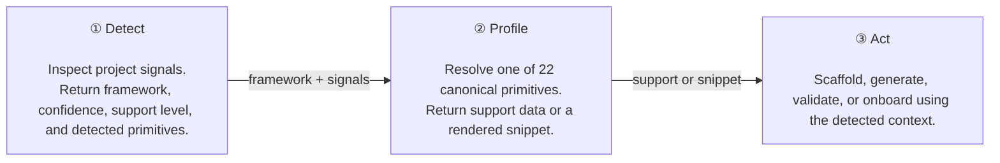
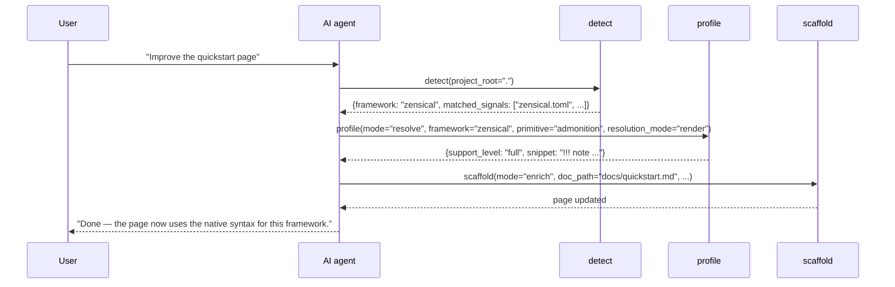

# Detect → Profile → Act

Every high-quality docs change starts the same way: identify the framework, resolve the primitive behavior, then write or validate with that context. This is the core workflow that keeps `mcp-zen-of-docs` predictable.

The redesigned CLI did **not** change the pattern. It changed how the results are presented:

- **Human mode** explains the result briefly.
- **`--json` mode** preserves the raw payload for automation.

---

## The problem

- `!!! note`, `:::note`, and framework-specific component syntax can all mean the same thing.
- AI models train on all of those forms at once, so generic output is often a blend.
- Prompting harder does not solve that. Reading the project first does.

---

## The pattern



---

## Step 1 — Detect

**What it does:** scans `project_root` and returns the most likely documentation framework, plus supporting evidence.

**What matters most in the response:**

- `framework`
- `support_level`
- `confidence`
- `matched_signals`
- `authoring_primitives`

### MCP / raw JSON shape

```json
{
  "status": "success",
  "tool": "detect_docs_context",
  "project_root": ".",
  "framework_detection": {
    "best_match": {
      "framework": "zensical",
      "support_level": "full",
      "confidence": 1.0,
      "matched_signals": ["zensical.toml", "pyproject:zensical"],
      "authoring_primitives": ["frontmatter", "heading-h1", "admonition", "code-fence", "..."]
    }
  }
}
```

### Human CLI equivalent

```bash
mcp-zen-of-docs --human detect context --project-root .
```

Use `--json` if another program needs to read the raw contract directly.

---

## Step 2 — Profile

**What it does:** resolves how a specific primitive behaves in a specific framework.

The `profile` tool has three useful modes:

- `show` — see the catalog of primitives and framework capability information
- `resolve` — inspect one primitive in one framework
- `translate` — compare a primitive across two frameworks

### Support lookup

```bash
mcp-zen-of-docs --json profile resolve \
  --framework docusaurus \
  --primitive tabs
```

Example response shape:

```json
{
  "status": "success",
  "tool": "resolve_primitive",
  "framework": "docusaurus",
  "primitive": "tabs",
  "mode": "support",
  "support_lookup": {
    "support_level": "partial"
  },
  "render_result": null
}
```

### Render a framework-native snippet

```bash
mcp-zen-of-docs --json profile resolve \
  --framework zensical \
  --primitive admonition \
  --mode render \
  --topic "Prerequisites"
```

---

## Step 3 — Act

**What it does:** applies the resolved context to a real job.

Typical next actions:

- `scaffold` to create or enrich a page
- `generate` to produce diagrams, changelogs, or reference material
- `validate` to check structure and quality
- `onboard` / `setup` to initialize docs work in a task-shaped flow

Once a primitive is resolved, the assistant no longer needs to guess whether tabs are native, partial, or unsupported in that framework.

### CLI examples

```bash
# Human-oriented validation summary
mcp-zen-of-docs --human validate all --docs-root docs --check structure

# Human-oriented onboarding summary via the alias
mcp-zen-of-docs --human setup full --project-root . --mode skeleton
```

---

## End-to-end example



!!! note "Why this beats generic prompting"
    The important gain is not eloquence. It is *constraint*. The workflow anchors every docs edit to the repository's actual framework signals before content is generated.

---

## What to read next

<div class="grid cards" markdown>

-   :octicons-arrow-right-24: **Authoring Primitives**

    See the full 22-primitive vocabulary the toolchain works with.

    [:octicons-arrow-right-24: Read more](primitives.md)

-   :octicons-arrow-right-24: **profile tool reference**

    Learn the exact mode and parameter shapes for support lookups and rendered snippets.

    [:octicons-arrow-right-24: Go there](../tools/profile.md)

-   :octicons-arrow-right-24: **Quickstart**

    Follow the same pattern in a practical setup flow.

    [:octicons-arrow-right-24: Read quickstart](../quickstart.md)

</div>
