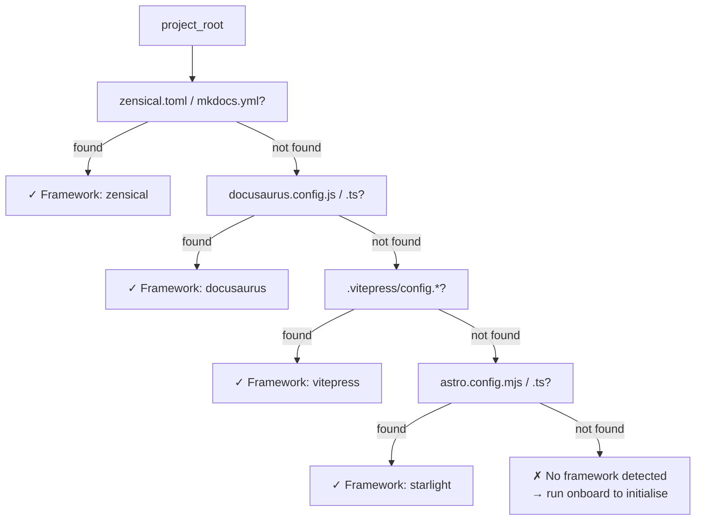

# detect

> Identifies your documentation framework from config files — the first step in every workflow.

Before your assistant or MCP client writes a documentation page, it needs to know which framework dialect to use. `detect` scans `project_root` for framework config files and returns the detected framework name, config path, and readiness status.

---

## Modes

| Mode | What it returns |
|------|----------------|
| `full` | Framework context **and** readiness gates (default) |
| `context` | Framework name, config path, support matrix only |
| `readiness` | Whether the project satisfies all tooling prerequisites |

---

## When to use it

Run `detect` first when you're unsure which framework owns a directory, or when debugging why another tool returned unexpected output. This is usually the first call in GitHub Copilot, Copilot CLI, Cursor, or any other MCP client. Use `mode="readiness"` in CI to gate deployment.

---

## Parameters

| Parameter | Type | Required | Description |
|-----------|------|----------|-------------|
| `mode` | string | No | Operation mode. Default: `"full"` |
| `project_root` | path | No | Directory to scan. Default: `"."` |

## How detection works

Detection scans `project_root` in priority order. The first config file found wins.



---

## Config files scanned

| Framework | Config files tried (in order) |
|-----------|-------------------------------|
| Zensical | `zensical.toml` · `mkdocs.yml` · `mkdocs.yaml` |
| Docusaurus | `docusaurus.config.js` · `docusaurus.config.ts` |
| VitePress | `.vitepress/config.mts` · `.vitepress/config.ts` · `.vitepress/config.js` |
| Starlight | `astro.config.mjs` · `astro.config.ts` |

---

## Examples

**Detect a Zensical project**

```json
{
  "tool": "detect",
  "arguments": { "project_root": "/Users/alice/projects/my-site" }
}
```

Returns:

```json
{
  "framework": "zensical",
  "config_path": "/Users/alice/projects/my-site/zensical.toml",
  "confidence": 0.99,
  "docs_root": "docs",
  "readiness": {
    "status": "ready",
    "gates_passed": 4,
    "gates_total": 4
  }
}
```

---

**When detection fails**

```json
{
  "framework": null,
  "config_path": null,
  "confidence": 0.0,
  "readiness": {
    "status": "not_ready",
    "gates_passed": 0,
    "gates_total": 4,
    "missing": [
      "No docs framework config found. Expected one of: zensical.toml, mkdocs.yml, docusaurus.config.js, .vitepress/config.mts, astro.config.mjs",
      "docs/ directory does not exist",
      "No index.md found"
    ]
  }
}
```

!!! tip "What to do when detection fails"
    Run `onboard` with `mode="init"` to initialise the directory structure. It creates the config file, `docs/` folder, and starter pages in one step.

---

**Readiness check for CI**

```json
{
  "tool": "detect",
  "arguments": { "mode": "readiness", "project_root": "./my-project" }
}
```

Returns:

```json
{
  "status": "ready",
  "framework": "docusaurus",
  "gates_passed": 4,
  "gates_total": 4,
  "checks": {
    "config_found": true,
    "docs_dir_exists": true,
    "index_page_exists": true,
    "nav_parseable": true
  }
}
```

Use `mode="readiness"` in CI to fail the build when the project isn't ready to publish.

---

## What to read next

<div class="grid cards" markdown>

-   :octicons-arrow-right-24: **profile**

    Once you know the framework, query its authoring capabilities and primitive support.

    [:octicons-arrow-right-24: Read profile](profile.md)

-   :octicons-arrow-right-24: **onboard**

    No framework detected? Run onboard to initialise the whole docs stack from scratch.

    [:octicons-arrow-right-24: Read onboard](onboard.md)

</div>
